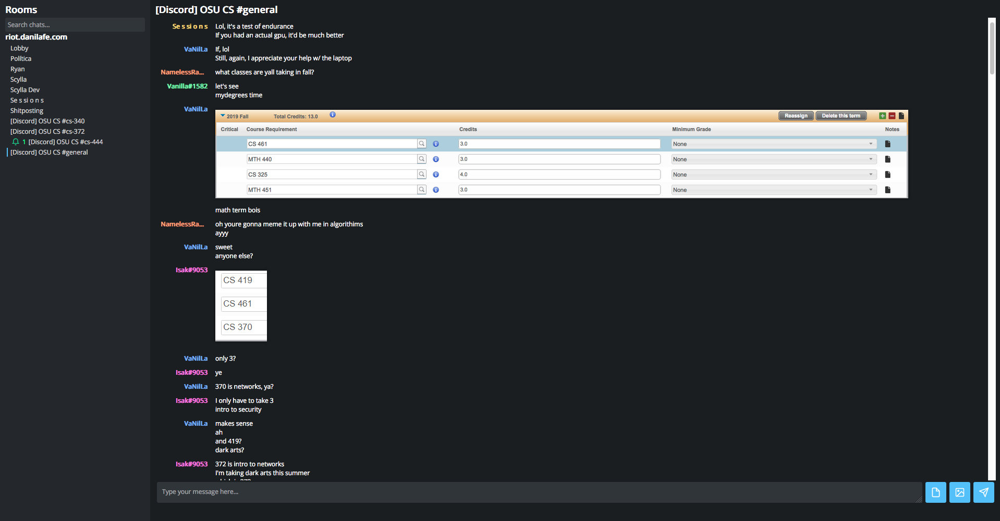
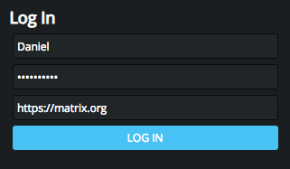
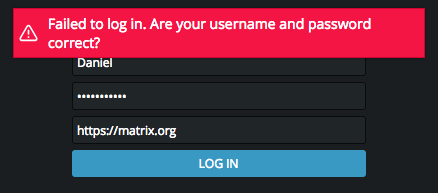

# Scylla
A minimalist client for the Matrix chat protocol. Come chat with me: #scylla:riot.danilafe.com

## Screenshots






## Why?
Riot, the flagship Matrix client, is slow. Switching rooms has a noticable delay (probably around several hundred milliseconds).
History loading causes strange jumps in the scroll position. Scylla aims to be faster and more responsive,
while still maintaining all the necessary features for a chat client. 

## What can it do?
Scylla currently supports the following features:
* Sending and receiving messages
* Sending and receiving images and files
* Converting Markdown into HTML for specially formatted messages
* Loading old history in a room

## Should I use Scylla?
Maybe. Scylla aims for a more minimalistic experience, remeniscent of IRC. It doesn't strive to have the rich chat client features
that Riot goes for, and attempts to polish the common tasks. If you would like a more advanced chat client, stick with Riot. However,
if you prefer polished minimalism, Scylla might be the client for you.

## Building Instructions
If you'd like to build Scylla, you need to take the following steps:
1. Install [Elm](https://elm-lang.org/) and [Sass](https://sass-lang.com/)

2. Compile Scylla's Elm and Sass source files:
```
elm make src/Main.elm --output static/js/elm.js --optimize
sass static/scss/style.scss static/css/style.css
```

3. Open the provided `index.html` file in your browser. You can't do it by just loading the file in Chrome;
you need to use an actual web server. I use Python2's built in HTTP server as such:
```
python2 -m SimpleHTTPServer
```
If you use this, visit the address `localhost:8000` once the server starts.

4. If you'd like to host Scylla, you need to be aware that it uses URLs as paths.
Because of this, in order for refreshing the page to work as intended,
you need to make sure that all URLs that don't start with "static" serve the
same `index.html` file. I use the following (Apache) configuration:
```
RewriteEngine on
RewriteCond %{REQUEST_URI} !^/static/
RewriteRule .* "/path/to/Scylla/index.html"
```
